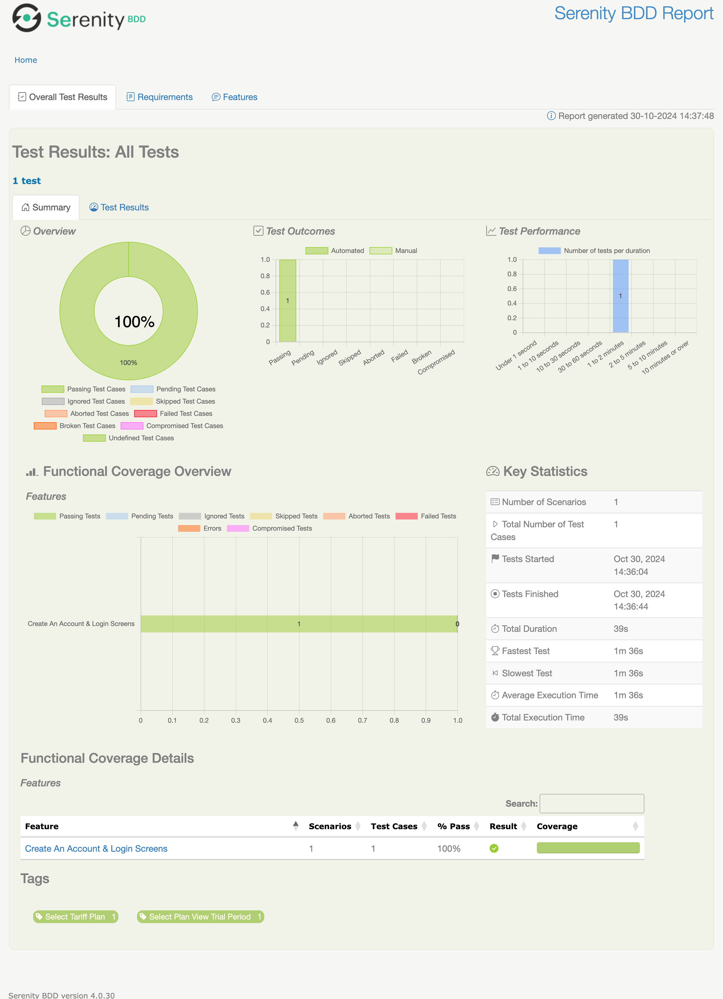

The Mobile App Automation UI provides a serenity framework for automating tests to achieve the stated
objectives
and key results.

## Objectives &amp; key results (OKRs)

Outlined is the objective of the MOBILE APP test automation:

* To `detect defects early` and provide `quick feedback` to the development team.

* Improve overall release confidence of the development team and other key stakeholders.

## Architecture

This framework promotes `cross-collaboration` in the form of `three amigos`, leveraging the principles
of `behaviour-driven development` to write the test scenarios and development syntax.

The development of the test automation framework uses the outlined technologies and `Java 16` as its underlying
programming language.

### Getting Started

Outlined before are the artefacts used to develop the automation framework and prerequisites to get started with setting
up your workstation to facilitate development locally:

#### Homebrew

[Brew](https://brew.sh/) is a `Mac OSX` or `Linux` missing package manager, below is how to install:

```bash
    /bin/bash -c "$(curl -fsSL https://raw.githubusercontent.com/Homebrew/install/HEAD/install.sh)"
```

#### Serenity-BDD

[Serenity BDD](https://serenity-bdd.github.io/theserenitybook/latest/index.html) is a test automation library designed
to make writing automated acceptance tests easier, and more fun.

#### Gradle

[Gradle](https://docs.gradle.org/) is a build automation tool for multi-language software development, helping teams
build, automate and deliver better software, faster.

Installing Gradle using the command line:

```bash
    brew install gradle
```

Kindly refer to [Gradle Installation Guide](https://gradle.org/install/) for further details on installing on `Linux`
and `Windows`.

## Quick Start

```bash
    git clone project.git
    cd project
    gradlew init
```

## Test Configuration &amp; Execution

Executing regression tests using this framework focuses on various configurations as defined in
the [serenity.properties](serenity.properties) file, outlined are some examples of the test execution commands:


### Test Execution Syntax

Running default test config:

```bash
    ./gradlew clean clearReports autoLintGradle test aggregate reports
```

Running tests via tags:

```bash
    ./gradlew clean clearReports autoLintGradle test aggregate reports -Dtags="@{tag}"
```

Running tests on specified environment:

```bash
    ./gradlew clean clearReports autoLintGradle test aggregate reports -Denvironment="{environment}"
```

### Test Reporting

Serenity auto-generates a test report for each run, which can be viewed
through [index.html](target/site/serenity/index.html) in any desired browser.

&copy; 2024 Test Application 